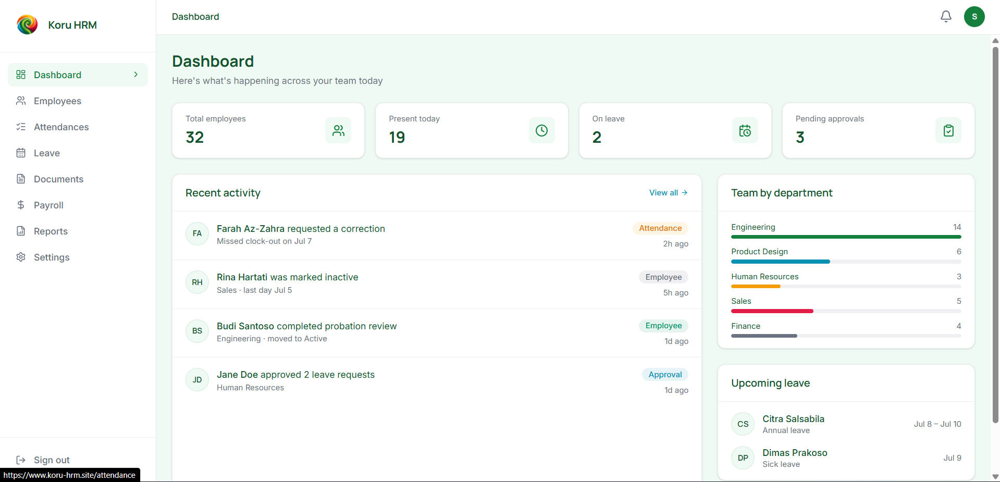
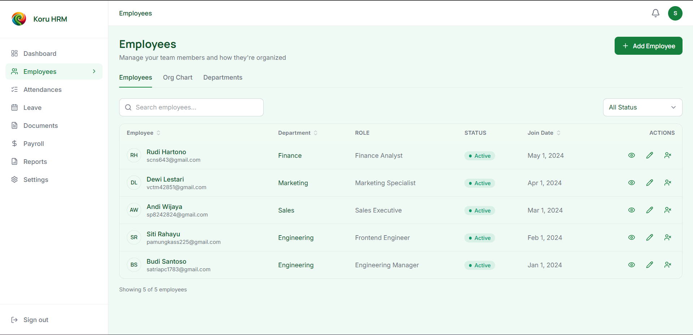
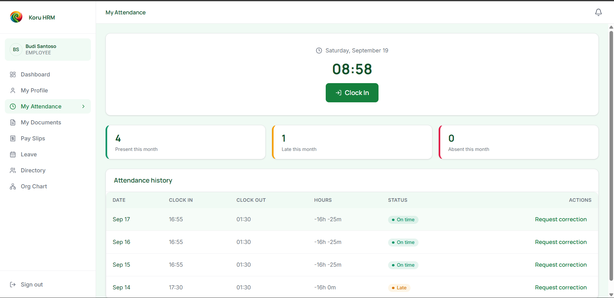
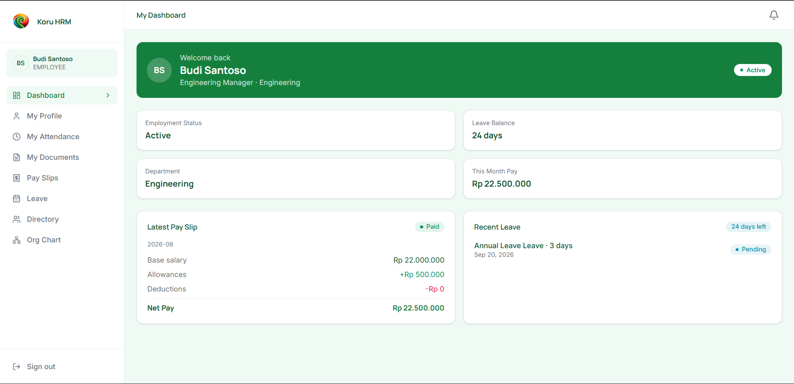

# Koru HRM Frontend

[](https://classroom.github.com/a/wEWvHaXF)

## Deployments

- **Frontend:** [www.koru-hrm.site](https://www.koru-hrm.site)
- **Backend API:** [api.koru-hrm.site](https://api.koru-hrm.site) — see the [koru-backend](https://github.com/sconos/crack-be-satria) repo for API docs and environment setup.

Koru HRM is a modern human resource management frontend built with Next.js. It provides a complete people operations experience for managing employees, attendance, leave, documents, payroll, reports, and system settings from a single dashboard.

## Overview

This application is designed for HR teams and employees to:

- view and manage employee profiles and organizational structure
- monitor attendance and attendance corrections
- manage leave requests and leave policies
- review payroll and payslips
- handle employee documents and uploads
- access reports and analytics
- configure departments, holidays, and job titles

## Features

- Admin and HR dashboard with quick insights
- Employee directory and profile management
- Department and org chart views
- Attendance tracking and status badges
- Leave approval workflow and request handling
- Payroll overview and payslip access
- Document upload and status tracking
- Reports and HR metrics
- Settings for holidays, leave types, and job titles
- Employee portal experience for self-service access

## Screenshots

| Dashboard | Employee Directory |
|---|---|
|  |  |

| Attendance | Employee Self Service |
|---|---|
|  | |

## Tech Stack

- Next.js 16
- React 19
- TypeScript
- Tailwind CSS
- Lucide React Icons
- Axios
- Zod
- D3 / d3-org-chart for org chart visualization
- Sonner for notifications

## Project Structure

```bash
src/
├── app/
│   ├── (auth)/         # login, session-related routes
│   ├── (dashboard)/    # admin/HR dashboard routes
│   ├── (portal)/       # employee self-service routes
│   └── globals.css
├── components/
│   ├── auth/
│   ├── dashboard/
│   ├── employee/
│   ├── payroll/
│   ├── portal/
│   ├── reports/
│   ├── settings/
│   └── ui/
├── lib/
│   ├── api/             # API client / request helpers
│   ├── mock-data/       # local fixtures used when backend is unavailable
│   ├── session.ts
│   ├── util.ts
│   └── validation.ts
├── types/
├── proxy.ts              # dev-time API proxy config
└── app/page.tsx
```

## Prerequisites

Before running the project, make sure you have:

- Node.js 20+ (required — matches Next.js 16 / React 19 support)
- npm or Bun installed

## Getting Started

1. Install dependencies:

```bash
npm install
```

or

```bash
bun install
```

2. Configure environment variables.

Copy the example env file and fill in your local values:

```bash
cp .env.example .env.local
```

| Variable | Description | Default |
|---|---|---|
| `NEXT_PUBLIC_API_URL` | Base URL of the backend API | `http://localhost:4000` |

3. Run the development server:

```bash
npm run dev
```

or

```bash
bun dev
```

Then open http://localhost:3000 in your browser.

## Available Scripts

```bash
npm run dev      # start the dev server
npm run build    # create production build
npm run start    # run the production server
npm run lint     # run ESLint checks
```

## Testing

No automated test suite is set up yet.

## Contributing

Internal/assignment project — no external contributions expected. If working with teammates, branch from `main` and open a PR for review.

## Notes

- This repository contains the frontend only.
- It expects a backend API running at `http://localhost:4000` unless you change the API URL in the environment configuration. Falls back to fixtures in `lib/mock-data/` where the backend isn't reachable.
- Authentication and route protection are handled with server-side session cookies and redirect logic in the app routing layer.

## License

This project is for educational and internal business use within the current assignment/workspace context. No open-source license is granted.